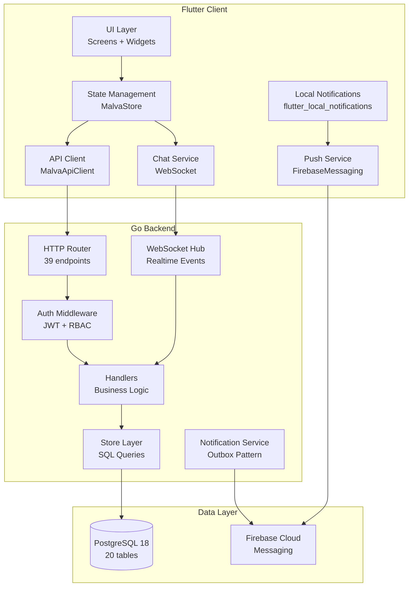
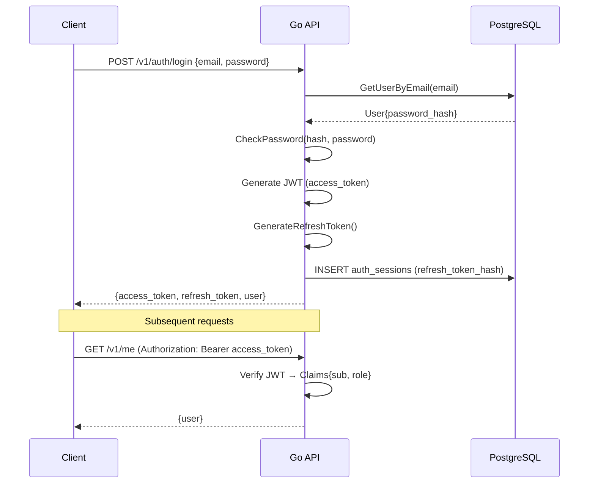
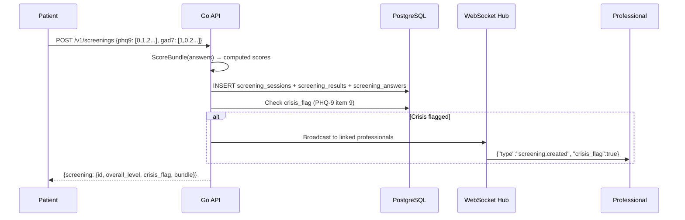
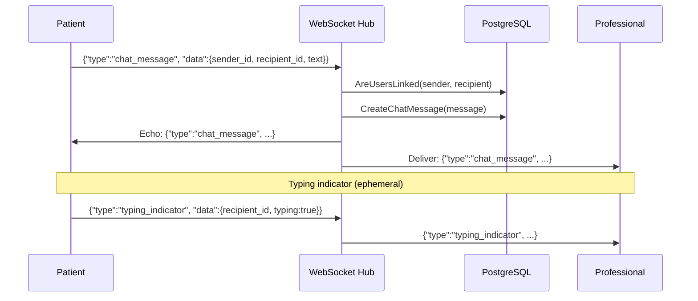
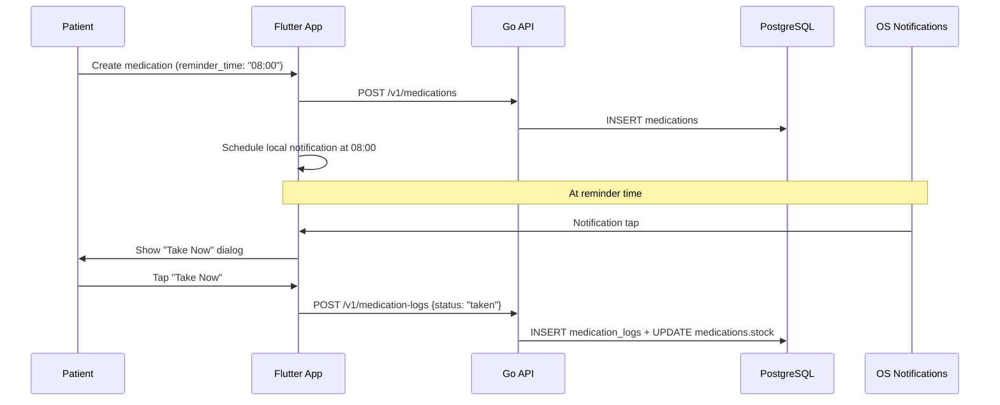
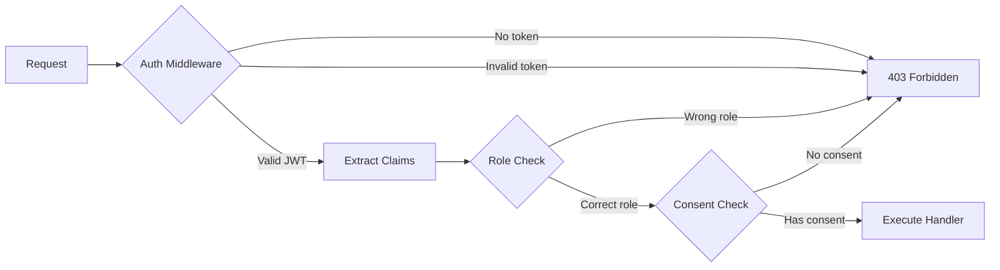
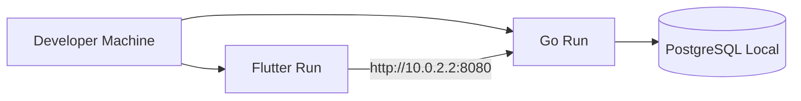
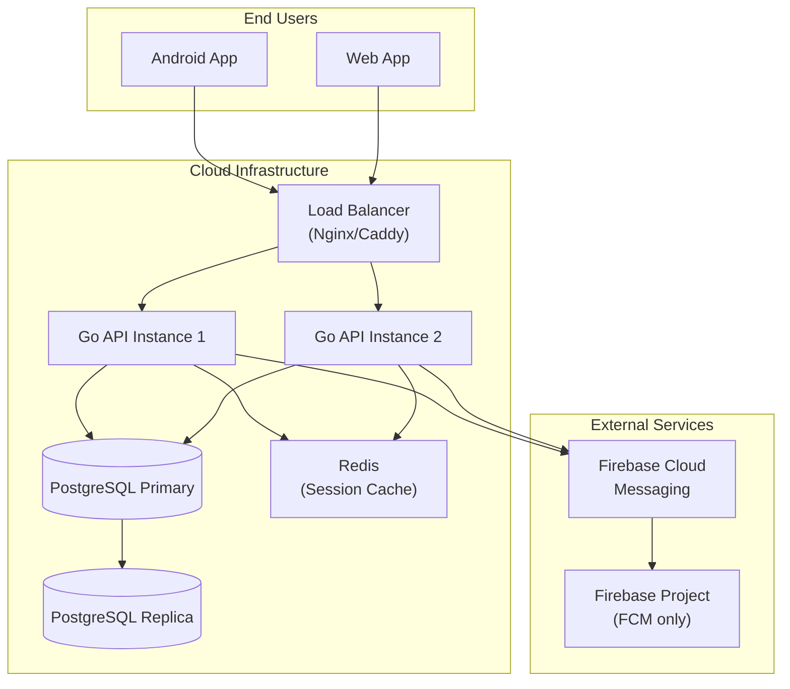

# System Architecture

**Malva Mental Health App**

| Field | Value |
|---|---|
| Version | 2.0 (Production) |
| Date | 2026-07-30 |
| Last Updated | 2026-07-30 |

---

## 1. Architecture Overview



## 2. Component Architecture

### 2.1 Flutter Client

```
lib/
├── main.dart                          # Entry point + Firebase init
├── firebase_options.dart              # FlutterFire config (generated)
├── src/
│   ├── malva_app.dart                 # App root, session management
│   ├── models.dart                    # Data models (MoodValue, ScreeningBundle, etc.)
│   ├── theme.dart                     # Material 3 theme (light + dark)
│   ├── assessment_engine.dart         # PHQ-9/GAD-7 scoring engine
│   ├── store/
│   │   └── malva_store.dart           # Central state management + secure storage
│   ├── services/
│   │   ├── malva_api_client.dart      # HTTP client (all API calls)
│   │   ├── chat_service.dart          # WebSocket chat
│   │   ├── push_notification_service.dart  # FCM + local notifications
│   │   ├── medication_reminder_service.dart # Local notification scheduling
│   │   └── dashboard_sync_service.dart     # 30s polling sync
│   └── screens/
│       ├── login_screen.dart          # Auth (register + login)
│       ├── patient_shell.dart         # Patient bottom nav container
│       ├── home_screen.dart           # Patient home
│       ├── mood_screen.dart           # Mood tracking
│       ├── medication_screen.dart     # Medication management
│       ├── diary_screen.dart          # Diary
│       ├── assessment_screen.dart     # PHQ-9 + GAD-7
│       ├── chat_screen.dart           # Real-time chat
│       ├── more_screen.dart           # Settings + extras
│       ├── professional_dashboard_screen.dart  # Professional dashboard
│       └── consent_management_screen.dart      # Privacy controls
```

### 2.2 Go Backend

```
backend/
├── cmd/api/main.go                    # Entry point
├── internal/
│   ├── config/config.go               # Environment config
│   ├── auth/
│   │   ├── password.go                # bcrypt hash/check
│   │   ├── jwt.go                     # JWT create/verify
│   │   ├── refresh.go                 # Refresh token gen/hash
│   │   └── role.go                    # Role normalization
│   ├── store/store.go                 # PostgreSQL data access
│   ├── server/server.go               # HTTP handlers + routing
│   ├── realtime/hub.go                # WebSocket hub
│   └── screening/engine.go            # PHQ-9/GAD-7 scoring
├── migrations/
│   ├── 001_initial.sql                # Core tables
│   ├── 002_auth_sessions.sql          # Auth sessions
│   ├── 003_professional_features.sql  # Notes, follow-ups, reviews
│   ├── 004_notification_center.sql    # Notifications + outbox
│   └── 005_chat.sql                   # Chat messages
├── .env                               # Local environment
├── Dockerfile                         # Container build
└── docker-compose.yml                 # Local dev stack
```

## 3. Data Flow

### 3.1 Authentication Flow



### 3.2 Screening Flow



### 3.3 Chat Flow



### 3.4 Medication Reminder Flow



## 4. Security Architecture

### 4.1 Authentication & Authorization



### 4.2 Data Access Matrix

| Resource | Patient Owner | Linked Professional | Unlinked Professional |
|---|---|---|---|
| Own screening | ✅ Read/Write | ✅ Read (with consent) | ❌ |
| Own mood | ✅ Read/Write | ✅ Read (with consent) | ❌ |
| Own diary | ✅ Read/Write | ✅ Read (with consent) | ❌ |
| Own medication | ✅ Read/Write | ✅ Read (with consent) | ❌ |
| Professional notes | ❌ (unless shared) | ✅ Read/Write (own) | ❌ |
| Follow-up messages | ✅ Read | ✅ Read/Write | ❌ |
| Chat messages | ✅ Read/Write | ✅ Read/Write | ❌ |
| Audit logs | ✅ Read (own) | ✅ Read (linked) | ❌ |
| Consent settings | ✅ Read/Write | ❌ | ❌ |

### 4.3 Security Controls

| Control | Implementation |
|---|---|
| Password hashing | bcrypt with cost factor 10 |
| JWT signing | HS256 with configurable secret |
| Token rotation | Refresh token rotated on every use |
| Session expiry | Access: 24h, Refresh: 30 days |
| Rate limiting | 20 req/min per IP on auth endpoints |
| Input validation | Server-side validation on all inputs |
| SQL injection | Parameterized queries (no string concatenation) |
| CORS | Configurable allowed origins |
| Audit logging | All data mutations logged with actor/patient |
| Data minimization | Only necessary data in responses |

## 5. Deployment Architecture

### 5.1 Development



### 5.2 Production



### 5.3 Container Configuration

```dockerfile
# Dockerfile
FROM golang:1.22-alpine AS builder
WORKDIR /app
COPY go.mod go.sum ./
RUN go mod download
COPY . .
RUN CGO_ENABLED=0 go build -o api ./cmd/api

FROM alpine:3.19
RUN apk --no-cache add ca-certificates
COPY --from=builder /app/api /api
EXPOSE 8080
CMD ["/api"]
```

## 6. Monitoring & Observability

| Metric | Tool | Alert Threshold |
|---|---|---|
| API response time | Application logs | > 500ms (p95) |
| Error rate | Application logs | > 1% of requests |
| WebSocket connections | Hub metrics | > 1000 concurrent |
| Database connections | PostgreSQL stats | > 80% pool usage |
| Memory usage | Container stats | > 80% of limit |
| Disk usage | PostgreSQL | > 80% of volume |
| FCM delivery rate | Firebase console | < 95% delivery |

## 7. Scalability Considerations

| Component | Current | Scaling Strategy |
|---|---|---|
| Flutter Client | Single build | Platform-specific builds (Android/iOS/Web) |
| Go API | Single instance | Horizontal scaling (multiple containers) |
| PostgreSQL | Single instance | Read replicas + connection pooling |
| WebSocket | Single hub | Sticky sessions or Redis pub/sub |
| FCM | Stateless | Managed by Firebase (auto-scales) |

## 8. Disaster Recovery

| Scenario | Recovery Strategy | RTO | RPO |
|---|---|---|---|
| API crash | Auto-restart (systemd/docker) | < 30s | 0 |
| Database crash | Restore from backup + WAL replay | < 1 hour | < 5 min |
| Full outage | Re-deploy from container image | < 2 hours | < 1 hour |
| Data corruption | Point-in-time recovery | < 4 hours | < 1 hour |

## 9. Migration Strategy

| Version | Changes | Downtime |
|---|---|---|
| 001_initial | Core tables (users, screenings, mood, diary, medication) | Zero |
| 002_auth_sessions | Refresh token sessions | Zero |
| 003_professional_features | Notes, follow-ups, screening reviews | Zero |
| 004_notification_center | Notifications + outbox | Zero |
| 005_chat | Chat messages | Zero |

All migrations use `CREATE TABLE IF NOT EXISTS` and are idempotent.
