# Database Schema

**Malva Mental Health App — PostgreSQL**

| Field | Value |
|---|---|
| Database | PostgreSQL 18 |
| Total Tables | 20 |
| Total Indexes | 13 |
| Custom Types | 4 enums |

---

## 1. Entity Relationship Diagram

```mermaid
erDiagram
    users ||--o| patient_profiles : "has profile"
    users ||--o| professional_profiles : "has profile"
    users ||--o{ auth_sessions : "has sessions"
    users ||--o{ device_tokens : "has tokens"
    users ||--o{ notifications : "receives"
    users ||--o{ audit_logs : "generates"

    users ||--o{ patient_professional_links : "patient links"
    users ||--o{ patient_professional_links : "professional links"

    users ||--o{ screening_sessions : "submits"
    screening_sessions ||--o{ screening_results : "contains"
    screening_results ||--o{ screening_answers : "has answers"
    screening_sessions ||--o{ screening_reviews : "reviewed by"

    users ||--o{ mood_checkins : "tracks mood"
    users ||--o{ diary_entries : "writes diary"
    users ||--o{ medications : "takes medication"
    medications ||--o{ medication_logs : "logged"
    users ||--o{ professional_notes : "creates notes"
    users ||--o{ follow_up_messages : "sends/receives"
    users ||--o{ chat_messages : "sends messages"

    users ||--o{ patient_data_consents : "consent settings"

    notifications ||--o{ notification_outbox : "queued"

    users {
        uuid id PK
        text email UK
        text password_hash
        user_role role
        text display_name
        timestamptz created_at
        timestamptz updated_at
        timestamptz disabled_at
    }

    patient_profiles {
        uuid user_id PK
        date date_of_birth
        text diagnosis_summary
        jsonb emergency_contact
        boolean privacy_mode
    }

    professional_profiles {
        uuid user_id PK
        text professional_id UK
        text license_label
        text organization
    }

    patient_professional_links {
        uuid patient_id PK
        uuid professional_id PK
        text status
        timestamptz created_at
    }

    screening_sessions {
        uuid id PK
        uuid patient_id FK
        uuid submitted_by FK
        text source
        boolean is_initial
        text rule_version
        risk_level overall_level
        boolean crisis_flag
        timestamptz created_at
    }

    screening_results {
        uuid id PK
        uuid session_id FK
        assessment_type type
        integer score
        integer max_score
        risk_level level
        text summary
        boolean crisis_flag
    }

    screening_answers {
        uuid id PK
        uuid result_id FK
        text question_id
        integer score
        integer position
    }

    screening_reviews {
        uuid id PK
        uuid screening_session_id FK
        uuid patient_id FK
        uuid professional_id FK
        text status
        text note
        timestamptz created_at
        timestamptz updated_at
    }

    auth_sessions {
        uuid id PK
        uuid user_id FK
        text refresh_token_hash UK
        text user_agent
        text ip_address
        timestamptz created_at
        timestamptz last_used_at
        timestamptz expires_at
        timestamptz revoked_at
    }

    professional_notes {
        uuid id PK
        uuid patient_id FK
        uuid professional_id FK
        text body
        text visibility
        timestamptz created_at
        timestamptz updated_at
        timestamptz archived_at
    }

    follow_up_messages {
        uuid id PK
        uuid patient_id FK
        uuid professional_id FK
        text body
        text status
        timestamptz created_at
        timestamptz updated_at
        timestamptz read_at
        timestamptz archived_at
    }

    mood_checkins {
        uuid id PK
        uuid patient_id FK
        text mood
        numeric sleep_hours
        integer energy
        integer anxiety
        integer irritability
        text note
        timestamptz occurred_at
        timestamptz created_at
    }

    diary_entries {
        uuid id PK
        uuid patient_id FK
        text mood
        text title
        text note
        boolean shared_with_professionals
        text professional_feedback
        timestamptz occurred_at
        timestamptz created_at
        timestamptz updated_at
        timestamptz deleted_at
    }

    medications {
        uuid id PK
        uuid patient_id FK
        text name
        text dosage
        text form
        text reminder_time
        text relation_to_meal
        integer current_stock
        integer alert_below
        text source
        boolean active
        timestamptz created_at
        timestamptz updated_at
    }

    medication_logs {
        uuid id PK
        uuid patient_id FK
        uuid medication_id FK
        text medication_name
        text status
        timestamptz taken_at
        timestamptz created_at
    }

    patient_data_consents {
        uuid patient_id PK
        uuid professional_id PK
        boolean share_screenings
        boolean share_mood_diary
        boolean share_medications
        boolean share_timeline
        timestamptz updated_at
    }

    device_tokens {
        uuid id PK
        uuid user_id FK
        text platform
        text token UK
        boolean enabled
        timestamptz last_seen_at
        timestamptz created_at
    }

    notifications {
        uuid id PK
        uuid user_id FK
        text type
        text title
        text body
        jsonb data
        boolean privacy_sensitive
        notification_status status
        timestamptz created_at
        timestamptz sent_at
        timestamptz read_at
    }

    notification_outbox {
        uuid id PK
        uuid notification_id FK
        text provider
        integer attempts
        timestamptz next_attempt_at
        timestamptz locked_at
        timestamptz delivered_at
        text last_error
        timestamptz created_at
    }

    audit_logs {
        uuid id PK
        uuid actor_id FK
        uuid patient_id FK
        text action
        text entity_type
        uuid entity_id
        jsonb metadata
        timestamptz created_at
    }

    chat_messages {
        text id PK
        uuid patient_id FK
        uuid professional_id FK
        uuid sender_id FK
        text sender_name
        text text
        timestamptz created_at
    }
```



## 2. Custom Types (Enums)

```sql
CREATE TYPE user_role AS ENUM ('patient', 'professional', 'admin');
CREATE TYPE risk_level AS ENUM ('minimal', 'mild', 'moderate', 'severe', 'crisis');
CREATE TYPE assessment_type AS ENUM ('phq9', 'gad7');
CREATE TYPE notification_status AS ENUM ('pending', 'sent', 'failed');
```

## 3. Table Details

### 3.1 users

| Column | Type | Constraints | Description |
|---|---|---|---|
| `id` | uuid | PK, DEFAULT gen_random_uuid() | Unique user identifier |
| `email` | text | NOT NULL, UNIQUE | Login email |
| `password_hash` | text | NOT NULL | bcrypt hashed password |
| `role` | user_role | NOT NULL | patient / professional / admin |
| `display_name` | text | NOT NULL | Display name |
| `created_at` | timestamptz | NOT NULL, DEFAULT now() | Account creation time |
| `updated_at` | timestamptz | NOT NULL, DEFAULT now() | Last profile update |
| `disabled_at` | timestamptz | NULLABLE | Account deactivation time |

### 3.2 patient_profiles

| Column | Type | Constraints | Description |
|---|---|---|---|
| `user_id` | uuid | PK, FK → users(id) CASCADE | Patient user ID |
| `date_of_birth` | date | NULLABLE | Date of birth |
| `diagnosis_summary` | text | NULLABLE | Clinical diagnosis summary |
| `emergency_contact` | jsonb | NOT NULL, DEFAULT '{}' | Emergency contact info |
| `privacy_mode` | boolean | NOT NULL, DEFAULT true | Lock screen privacy mode |

### 3.3 professional_profiles

| Column | Type | Constraints | Description |
|---|---|---|---|
| `user_id` | uuid | PK, FK → users(id) CASCADE | Professional user ID |
| `professional_id` | text | NOT NULL, UNIQUE | License / registration number |
| `license_label` | text | NULLABLE | License type (e.g., Sp.KJ.) |
| `organization` | text | NULLABLE | Workplace organization |

### 3.4 patient_professional_links

| Column | Type | Constraints | Description |
|---|---|---|---|
| `patient_id` | uuid | PK, FK → users(id) CASCADE | Patient user ID |
| `professional_id` | uuid | PK, FK → users(id) CASCADE | Professional user ID |
| `status` | text | NOT NULL, DEFAULT 'active' | active / inactive |
| `created_at` | timestamptz | NOT NULL, DEFAULT now() | Link creation time |

**Index:** `patient_professional_links_professional_idx` ON (professional_id, created_at DESC) WHERE status = 'active'

### 3.5 screening_sessions

| Column | Type | Constraints | Description |
|---|---|---|---|
| `id` | uuid | PK, DEFAULT gen_random_uuid() | Screening session ID |
| `patient_id` | uuid | NOT NULL, FK → users(id) CASCADE | Patient being screened |
| `submitted_by` | uuid | NOT NULL, FK → users(id) | Submitter (patient or professional) |
| `source` | text | NOT NULL, DEFAULT 'patient_app' | Submission source |
| `is_initial` | boolean | NOT NULL, DEFAULT false | Initial screening flag |
| `rule_version` | text | NOT NULL | Scoring rule version |
| `overall_level` | risk_level | NOT NULL | Overall risk level |
| `crisis_flag` | boolean | NOT NULL, DEFAULT false | Crisis detection flag |
| `created_at` | timestamptz | NOT NULL, DEFAULT now() | Submission time |

**Index:** `screening_sessions_patient_created_idx` ON (patient_id, created_at DESC)

### 3.6 screening_results

| Column | Type | Constraints | Description |
|---|---|---|---|
| `id` | uuid | PK, DEFAULT gen_random_uuid() | Result ID |
| `session_id` | uuid | NOT NULL, FK → screening_sessions(id) CASCADE | Parent session |
| `type` | assessment_type | NOT NULL | phq9 / gad7 |
| `score` | integer | NOT NULL, CHECK (score >= 0) | Computed score |
| `max_score` | integer | NOT NULL, CHECK (max_score > 0) | Maximum possible score |
| `level` | risk_level | NOT NULL | Risk level classification |
| `summary` | text | NOT NULL | Human-readable summary |
| `crisis_flag` | boolean | NOT NULL, DEFAULT false | Crisis detection |

**Constraint:** UNIQUE (session_id, type)

### 3.7 screening_answers

| Column | Type | Constraints | Description |
|---|---|---|---|
| `id` | uuid | PK, DEFAULT gen_random_uuid() | Answer ID |
| `result_id` | uuid | NOT NULL, FK → screening_results(id) CASCADE | Parent result |
| `question_id` | text | NOT NULL | Question identifier |
| `score` | integer | NOT NULL, CHECK (score BETWEEN 0 AND 3) | Answer score (0-3) |
| `position` | integer | NOT NULL, CHECK (position > 0) | Question position |

**Constraint:** UNIQUE (result_id, question_id)

### 3.8 screening_reviews

| Column | Type | Constraints | Description |
|---|---|---|---|
| `id` | uuid | PK, DEFAULT gen_random_uuid() | Review ID |
| `screening_session_id` | uuid | NOT NULL, FK → screening_sessions(id) CASCADE | Screened session |
| `patient_id` | uuid | NOT NULL, FK → users(id) CASCADE | Patient |
| `professional_id` | uuid | NOT NULL, FK → users(id) CASCADE | Reviewing professional |
| `status` | text | NOT NULL, DEFAULT 'reviewed' | reviewed / needs_follow_up / closed |
| `note` | text | NOT NULL, DEFAULT '' | Review note |
| `created_at` | timestamptz | NOT NULL, DEFAULT now() | Review creation time |
| `updated_at` | timestamptz | NOT NULL, DEFAULT now() | Last update time |

**Constraint:** UNIQUE (screening_session_id, professional_id)

### 3.9 auth_sessions

| Column | Type | Constraints | Description |
|---|---|---|---|
| `id` | uuid | PK, DEFAULT gen_random_uuid() | Session ID |
| `user_id` | uuid | NOT NULL, FK → users(id) CASCADE | User |
| `refresh_token_hash` | text | NOT NULL, UNIQUE | Hashed refresh token |
| `user_agent` | text | NULLABLE | Client user agent |
| `ip_address` | text | NULLABLE | Client IP address |
| `created_at` | timestamptz | NOT NULL, DEFAULT now() | Session creation |
| `last_used_at` | timestamptz | NULLABLE | Last token use |
| `expires_at` | timestamptz | NOT NULL | Expiration time |
| `revoked_at` | timestamptz | NULLABLE | Revocation time |

**Index:** `auth_sessions_user_active_idx` ON (user_id, expires_at DESC) WHERE revoked_at IS NULL

### 3.10 professional_notes

| Column | Type | Constraints | Description |
|---|---|---|---|
| `id` | uuid | PK, DEFAULT gen_random_uuid() | Note ID |
| `patient_id` | uuid | NOT NULL, FK → users(id) CASCADE | Patient |
| `professional_id` | uuid | NOT NULL, FK → users(id) CASCADE | Authoring professional |
| `body` | text | NOT NULL | Note content |
| `visibility` | text | NOT NULL, DEFAULT 'private' | private / shared_with_patient |
| `created_at` | timestamptz | NOT NULL, DEFAULT now() | Creation time |
| `updated_at` | timestamptz | NOT NULL, DEFAULT now() | Last update time |
| `archived_at` | timestamptz | NULLABLE | Soft delete time |

**Index:** `professional_notes_patient_idx` ON (patient_id, updated_at DESC) WHERE archived_at IS NULL

### 3.11 follow_up_messages

| Column | Type | Constraints | Description |
|---|---|---|---|
| `id` | uuid | PK, DEFAULT gen_random_uuid() | Message ID |
| `patient_id` | uuid | NOT NULL, FK → users(id) CASCADE | Recipient patient |
| `professional_id` | uuid | NOT NULL, FK → users(id) CASCADE | Sender professional |
| `body` | text | NOT NULL | Message content |
| `status` | text | NOT NULL, DEFAULT 'sent' | draft / sent |
| `created_at` | timestamptz | NOT NULL, DEFAULT now() | Creation time |
| `updated_at` | timestamptz | NOT NULL, DEFAULT now() | Last update time |
| `read_at` | timestamptz | NULLABLE | Patient read time |
| `archived_at` | timestamptz | NULLABLE | Soft delete time |

**Index:** `follow_up_messages_patient_idx` ON (patient_id, created_at DESC) WHERE archived_at IS NULL

### 3.12 mood_checkins

| Column | Type | Constraints | Description |
|---|---|---|---|
| `id` | uuid | PK, DEFAULT gen_random_uuid() | Check-in ID |
| `patient_id` | uuid | NOT NULL, FK → users(id) CASCADE | Patient |
| `mood` | text | NOT NULL | great / good / okay / sad / awful |
| `sleep_hours` | numeric(4,1) | NOT NULL, DEFAULT 0 | Hours of sleep |
| `energy` | integer | NOT NULL, CHECK (0-10) | Energy level |
| `anxiety` | integer | NOT NULL, CHECK (0-10) | Anxiety level |
| `irritability` | integer | NOT NULL, CHECK (0-10) | Irritability level |
| `note` | text | NOT NULL, DEFAULT '' | Free-form note |
| `occurred_at` | timestamptz | NOT NULL, DEFAULT now() | When the mood was recorded |
| `created_at` | timestamptz | NOT NULL, DEFAULT now() | Record creation time |

**Index:** `mood_checkins_patient_idx` ON (patient_id, occurred_at DESC)

### 3.13 diary_entries

| Column | Type | Constraints | Description |
|---|---|---|---|
| `id` | uuid | PK, DEFAULT gen_random_uuid() | Entry ID |
| `patient_id` | uuid | NOT NULL, FK → users(id) CASCADE | Patient |
| `mood` | text | NOT NULL | great / good / okay / sad / awful |
| `title` | text | NOT NULL | Entry title (max 160 chars) |
| `note` | text | NOT NULL | Entry content (max 6000 chars) |
| `shared_with_professionals` | boolean | NOT NULL, DEFAULT true | Visibility to professionals |
| `professional_feedback` | text | NULLABLE | Professional's feedback |
| `occurred_at` | timestamptz | NOT NULL, DEFAULT now() | When the diary was written |
| `created_at` | timestamptz | NOT NULL, DEFAULT now() | Record creation time |
| `updated_at` | timestamptz | NOT NULL, DEFAULT now() | Last update time |
| `deleted_at` | timestamptz | NULLABLE | Soft delete time |

**Index:** `diary_entries_patient_idx` ON (patient_id, occurred_at DESC) WHERE deleted_at IS NULL

### 3.14 medications

| Column | Type | Constraints | Description |
|---|---|---|---|
| `id` | uuid | PK, DEFAULT gen_random_uuid() | Medication ID |
| `patient_id` | uuid | NOT NULL, FK → users(id) CASCADE | Patient |
| `name` | text | NOT NULL | Medication name |
| `dosage` | text | NOT NULL | Dosage (e.g., "50mg") |
| `form` | text | NOT NULL | Form (tablet, syrup, etc.) |
| `reminder_time` | text | NOT NULL, DEFAULT '' | Reminder time (HH:MM) |
| `relation_to_meal` | text | NOT NULL, DEFAULT '' | before_meal / after_meal / with_meal |
| `current_stock` | integer | NOT NULL, DEFAULT 0, CHECK (>= 0) | Current pill/unit count |
| `alert_below` | integer | NOT NULL, DEFAULT 0, CHECK (>= 0) | Low-stock threshold |
| `source` | text | NOT NULL, DEFAULT 'patient' | patient / professional |
| `active` | boolean | NOT NULL, DEFAULT true | Active flag |
| `created_at` | timestamptz | NOT NULL, DEFAULT now() | Creation time |
| `updated_at` | timestamptz | NOT NULL, DEFAULT now() | Last update time |

**Index:** `medications_patient_idx` ON (patient_id, updated_at DESC) WHERE active

### 3.15 medication_logs

| Column | Type | Constraints | Description |
|---|---|---|---|
| `id` | uuid | PK, DEFAULT gen_random_uuid() | Log ID |
| `patient_id` | uuid | NOT NULL, FK → users(id) CASCADE | Patient |
| `medication_id` | uuid | FK → medications(id) SET NULL | Medication reference |
| `medication_name` | text | NOT NULL | Medication name (denormalized) |
| `status` | text | NOT NULL, DEFAULT 'taken' | taken / missed / skipped |
| `taken_at` | timestamptz | NOT NULL, DEFAULT now() | When the dose was taken |
| `created_at` | timestamptz | NOT NULL, DEFAULT now() | Record creation time |

**Index:** `medication_logs_patient_idx` ON (patient_id, taken_at DESC)

### 3.16 patient_data_consents

| Column | Type | Constraints | Description |
|---|---|---|---|
| `patient_id` | uuid | PK, FK → users(id) CASCADE | Patient |
| `professional_id` | uuid | PK, FK → users(id) CASCADE | Professional |
| `share_screenings` | boolean | NOT NULL, DEFAULT true | Share screening data |
| `share_mood_diary` | boolean | NOT NULL, DEFAULT true | Share mood & diary data |
| `share_medications` | boolean | NOT NULL, DEFAULT true | Share medication data |
| `share_timeline` | boolean | NOT NULL, DEFAULT true | Share timeline data |
| `updated_at` | timestamptz | NOT NULL, DEFAULT now() | Last update time |

### 3.17 device_tokens

| Column | Type | Constraints | Description |
|---|---|---|---|
| `id` | uuid | PK, DEFAULT gen_random_uuid() | Token ID |
| `user_id` | uuid | NOT NULL, FK → users(id) CASCADE | User |
| `platform` | text | NOT NULL | android / ios / web |
| `token` | text | NOT NULL, UNIQUE | FCM device token |
| `enabled` | boolean | NOT NULL, DEFAULT true | Active flag |
| `last_seen_at` | timestamptz | NOT NULL, DEFAULT now() | Last token use |
| `created_at` | timestamptz | NOT NULL, DEFAULT now() | Registration time |

**Index:** `device_tokens_user_enabled_idx` ON (user_id) WHERE enabled

### 3.18 notifications

| Column | Type | Constraints | Description |
|---|---|---|---|
| `id` | uuid | PK, DEFAULT gen_random_uuid() | Notification ID |
| `user_id` | uuid | NOT NULL, FK → users(id) CASCADE | Recipient |
| `type` | text | NOT NULL | Notification type |
| `title` | text | NOT NULL | Notification title |
| `body` | text | NOT NULL | Notification body |
| `data` | jsonb | NOT NULL, DEFAULT '{}' | Additional data |
| `privacy_sensitive` | boolean | NOT NULL, DEFAULT true | Hide on lock screen |
| `status` | notification_status | NOT NULL, DEFAULT 'pending' | pending / sent / failed |
| `created_at` | timestamptz | NOT NULL, DEFAULT now() | Creation time |
| `sent_at` | timestamptz | NULLABLE | Delivery time |
| `read_at` | timestamptz | NULLABLE | Read time |

**Index:** `notifications_user_created_idx` ON (user_id, created_at DESC)
**Index:** `notifications_user_unread_idx` ON (user_id, created_at DESC) WHERE read_at IS NULL

### 3.19 notification_outbox

| Column | Type | Constraints | Description |
|---|---|---|---|
| `id` | uuid | PK, DEFAULT gen_random_uuid() | Outbox ID |
| `notification_id` | uuid | NOT NULL, FK → notifications(id) CASCADE | Parent notification |
| `provider` | text | NOT NULL, DEFAULT 'fcm' | Delivery provider |
| `attempts` | integer | NOT NULL, DEFAULT 0 | Delivery attempt count |
| `next_attempt_at` | timestamptz | NOT NULL, DEFAULT now() | Next retry time |
| `locked_at` | timestamptz | NULLABLE | Processing lock |
| `delivered_at` | timestamptz | NULLABLE | Delivery confirmation |
| `last_error` | text | NULLABLE | Last error message |
| `created_at` | timestamptz | NOT NULL, DEFAULT now() | Creation time |

**Index:** `notification_outbox_ready_idx` ON (next_attempt_at) WHERE delivered_at IS NULL

### 3.20 audit_logs

| Column | Type | Constraints | Description |
|---|---|---|---|
| `id` | uuid | PK, DEFAULT gen_random_uuid() | Log ID |
| `actor_id` | uuid | FK → users(id) | Actor (who performed the action) |
| `patient_id` | uuid | FK → users(id) | Patient whose data was accessed |
| `action` | text | NOT NULL | Action description |
| `entity_type` | text | NOT NULL | Entity type (screening, mood, etc.) |
| `entity_id` | uuid | NULLABLE | Entity ID |
| `metadata` | jsonb | NOT NULL, DEFAULT '{}' | Additional metadata |
| `created_at` | timestamptz | NOT NULL, DEFAULT now() | Action time |

**Index:** `audit_logs_patient_created_idx` ON (patient_id, created_at DESC)

### 3.21 chat_messages

| Column | Type | Constraints | Description |
|---|---|---|---|
| `id` | text | PK | Message ID (client-generated) |
| `patient_id` | uuid | NOT NULL, FK → users(id) | Patient in conversation |
| `professional_id` | uuid | NOT NULL, FK → users(id) | Professional in conversation |
| `sender_id` | uuid | NOT NULL, FK → users(id) | Message sender |
| `sender_name` | text | NOT NULL, DEFAULT '' | Sender display name |
| `text` | text | NOT NULL | Message content |
| `created_at` | timestamptz | NOT NULL, DEFAULT now() | Send time |

**Index:** `idx_chat_messages_conv` ON (patient_id, professional_id, created_at DESC)
