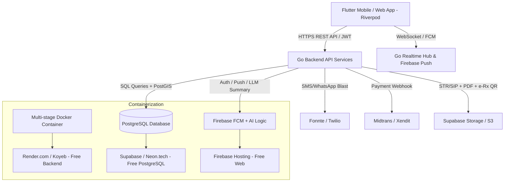

# Implementation Plan - Malva Mental Health v2.0

Dokumen ini berisi strategi teknis lengkap, hosting hemat biaya, dan roadmap pengembangan **Malva Mental Health** dengan Safety Protocol, Booking/Payment, dan Professional Trust System.

---

## 1. Arsitektur Sistem & Tech Stack



### Stack Teknologi:
1. **Frontend**: Flutter 3.44+ dengan **Riverpod** + Material 3 + palet Malva 100% konsisten
2. **Backend**: **Golang (Go)** — efisien untuk free tier
3. **Database**: **PostgreSQL 18 + PostGIS** (jarak/doctor discovery)
4. **Realtime**: **FCM** (high priority crisis channel) + **WebSocket**
5. **AI Summary**: **Gemini 1.5 Flash** via Firebase AI Logic / Vertex AI — Go backend eksekusi prompt, data tidak dipakai melatih model publik
6. **Payment**: **Midtrans/Xendit** — e-wallet, VA, bank, credit card; webhook dengan signature validation
7. **SMS/WhatsApp**: **Fonnte / Twilio** — silent SOS blast
8. **Maps**: **flutter_map + OpenStreetMap** (100% gratis, no API key, tanpa kartu kredit)
9. **Object Storage**: **Supabase Storage / S3** — dokumen STR/SIP, PDF resep, dokumen vault, e-Rx QR

---

## 2. Strategi Kontainersiasi Hemat Biaya (Zero Subscription)

### 2.1. Multi-Stage Dockerfile Backend Go
```dockerfile
FROM golang:1.22-alpine AS builder
WORKDIR /app
COPY go.mod go.sum ./
RUN go mod download
COPY . .
RUN CGO_ENABLED=0 GOOS=linux go build -ldflags="-w -s" -o main ./cmd/api

FROM alpine:latest
RUN apk --no-cache add ca-certificates tzdata
WORKDIR /root/
COPY --from=builder /app/main .
COPY --from=builder /app/migrations ./migrations
EXPOSE 8080
CMD ["./main"]
```

### 2.2. docker-compose.yml (lokal)
PostgreSQL 16-alpine + backend Go — satu perintah jalan.

---

## 3. Alternatif Hosting Gratis / Murah

| Komponen | Opsi 1 (Gratis) | Opsi 2 (Murah) | Catatan |
|---|---|---|---|
| **PostgreSQL** | **Supabase Free** (500MB, PostGIS ready) | Neon.tech Free | PostGIS wajib untuk Haversine doctor discovery |
| **Go Backend** | **Render.com Free** (512MB) | Koyeb Free | Go efisien |
| **Frontend Web** | **Firebase Hosting** | Vercel / CF Pages | SSL gratis |
| **FCM & SMS** | Firebase Spark (gratis) + Fonnte Dev (murah) | Twilio Pay-as-you-go | FCM tidak berbatas untuk push notif |
| **Gemini AI** | Vertex AI free tier via Firebase AI Logic | pay-per-token | Data medis tidak dipakai melatih model |
| **Object Storage** | Supabase Storage (free 500MB) | Cloudflare R2 (tak berbayar egress) | STR/SIP, vault, QR e-Rx |

---

## 4. Migrasi Database Baru (Migration 006 & 007)

### Migration 006: Progressive Profiling + Safety + Verification

```sql
-- 006_progressive_and_safety.sql
CREATE EXTENSION IF NOT EXISTS postgis;

ALTER TABLE users ADD COLUMN IF NOT EXISTS sso_provider VARCHAR(50);
ALTER TABLE users ADD COLUMN IF NOT EXISTS sso_id VARCHAR(255);
ALTER TABLE users ALTER COLUMN phone DROP NOT NULL;
ALTER TABLE users ADD COLUMN IF NOT EXISTS phone_verified_at TIMESTAMPTZ;

CREATE TABLE IF NOT EXISTS emergency_contacts (
    id UUID PRIMARY KEY DEFAULT gen_random_uuid(),
    patient_id UUID NOT NULL REFERENCES users(id) ON DELETE CASCADE,
    contact_name VARCHAR(100) NOT NULL,
    contact_phone VARCHAR(20) NOT NULL,
    relationship VARCHAR(50),
    is_default BOOLEAN NOT NULL DEFAULT false,
    created_at TIMESTAMPTZ DEFAULT CURRENT_TIMESTAMP
);
CREATE INDEX IF NOT EXISTS emergency_contacts_patient_idx ON emergency_contacts (patient_id, is_default);

CREATE TABLE IF NOT EXISTS crisis_incidents (
    id UUID PRIMARY KEY DEFAULT gen_random_uuid(),
    patient_id UUID NOT NULL REFERENCES users(id) ON DELETE CASCADE,
    triggered_by VARCHAR(20) NOT NULL, -- 'screening', 'sos_button', 'manual'
    phq9_q9_score INTEGER,
    latitude DOUBLE PRECISION,
    longitude DOUBLE PRECISION,
    status VARCHAR(20) NOT NULL DEFAULT 'active', -- 'active', 'resolved', 'false_positive'
    resolution_notes TEXT,
    resolved_by UUID REFERENCES users(id),
    doctor_notified_at TIMESTAMPTZ,
    contacts_notified_at TIMESTAMPTZ,
    created_at TIMESTAMPTZ DEFAULT CURRENT_TIMESTAMP,
    resolved_at TIMESTAMPTZ
);
CREATE INDEX IF NOT EXISTS crisis_incidents_patient_idx ON crisis_incidents (patient_id, status, created_at DESC);

CREATE TABLE IF NOT EXISTS sos_blast_log (
    id UUID PRIMARY KEY DEFAULT gen_random_uuid(),
    crisis_incident_id UUID NOT NULL REFERENCES crisis_incidents(id) ON DELETE CASCADE,
    contact_phone VARCHAR(20) NOT NULL,
    channel VARCHAR(10) NOT NULL, -- 'sms', 'whatsapp'
    status VARCHAR(20) NOT NULL DEFAULT 'pending', -- 'pending', 'sent', 'failed', 'delivered'
    message_id VARCHAR(255),
    created_at TIMESTAMPTZ DEFAULT CURRENT_TIMESTAMP,
    delivered_at TIMESTAMPTZ
);

CREATE TABLE IF NOT EXISTS professional_credentials (
    id UUID PRIMARY KEY DEFAULT gen_random_uuid(),
    user_id UUID NOT NULL REFERENCES users(id) ON DELETE CASCADE,
    str_number VARCHAR(100),
    sip_number VARCHAR(100),
    sipp_number VARCHAR(100),
    specialization VARCHAR(100) NOT NULL, -- 'Sp.KJ' atau 'M.Psi'
    sub_specialties TEXT[],
    hospital_lat DOUBLE PRECISION,
    hospital_lng DOUBLE PRECISION,
    hospital_name VARCHAR(255),
    address_details TEXT,
    is_bpjs_supported BOOLEAN NOT NULL DEFAULT false,
    photo_intro_url VARCHAR(255),
    video_intro_url VARCHAR(255),
    bio TEXT,
    education JSONB NOT NULL DEFAULT '[]'::jsonb, -- [{institution, year, degree}]
    verification_status VARCHAR(20) DEFAULT 'PENDING', -- 'PENDING', 'VERIFIED', 'REJECTED'
    rejection_reason TEXT,
    verified_by UUID,
    verified_at TIMESTAMPTZ,
    document_url TEXT,
    legacy_count INTEGER NOT NULL DEFAULT 0, -- jumlah sesi historis
    helpfulness_count INTEGER NOT NULL DEFAULT 0, -- jumlah positif
    review_count INTEGER NOT NULL DEFAULT 0,
    years_experience INTEGER NOT NULL DEFAULT 0,
    created_at TIMESTAMPTZ DEFAULT CURRENT_TIMESTAMP
);

CREATE TABLE IF NOT EXISTS professional_schedules (
    id UUID PRIMARY KEY DEFAULT gen_random_uuid(),
    professional_id UUID NOT NULL REFERENCES users(id) ON DELETE CASCADE,
    day_of_week INTEGER NOT NULL, -- 0=Sunday - 6=Saturday
    start_time TIME NOT NULL,
    end_time TIME NOT NULL,
    slot_duration_minutes INTEGER NOT NULL DEFAULT 30,
    is_active BOOLEAN NOT NULL DEFAULT true,
    created_at TIMESTAMPTZ DEFAULT CURRENT_TIMESTAMP
);

CREATE TABLE IF NOT EXISTS service_packages (
    id UUID PRIMARY KEY DEFAULT gen_random_uuid(),
    professional_id UUID NOT NULL REFERENCES users(id) ON DELETE CASCADE,
    package_sessions INTEGER NOT NULL, -- 1, 2, 3, 6
    package_duration_days INTEGER NOT NULL, -- validity: 60, 90, 365
    price BIGINT NOT NULL, -- IDR
    label VARCHAR(50), -- e.g. 'Lebih Hemat'
    is_active BOOLEAN NOT NULL DEFAULT true
);

CREATE TABLE IF NOT EXISTS bookings (
    id UUID PRIMARY KEY DEFAULT gen_random_uuid(),
    patient_id UUID NOT NULL REFERENCES users(id) ON DELETE CASCADE,
    professional_id UUID NOT NULL REFERENCES users(id) ON DELETE CASCADE,
    package_id UUID REFERENCES service_packages(id),
    service_type VARCHAR(20) NOT NULL, -- 'quick_consult', 'continuous'
    session_type VARCHAR(10) NOT NULL, -- 'chat', 'video'
    booking_date DATE NOT NULL,
    slot_time TIME NOT NULL,
    duration_minutes INTEGER NOT NULL DEFAULT 30,
    price BIGINT NOT NULL,
    status VARCHAR(20) NOT NULL DEFAULT 'pending', -- 'pending', 'paid', 'active', 'completed', 'cancelled'
    created_at TIMESTAMPTZ DEFAULT CURRENT_TIMESTAMP
);

CREATE TABLE IF NOT EXISTS payments (
    id UUID PRIMARY KEY DEFAULT gen_random_uuid(),
    booking_id UUID NOT NULL REFERENCES bookings(id) ON DELETE CASCADE,
    payment_method VARCHAR(20) NOT NULL, -- 'gopay','ovo','dana','shopeepay','bca','mandiri','cc'
    gross_amount BIGINT NOT NULL,
    service_fee_amount BIGINT NOT NULL DEFAULT 2000,
    platform_fee_pct SMALLINT NOT NULL DEFAULT 10,
    platform_fee_amount BIGINT NOT NULL,
    net_amount BIGINT NOT NULL,
    reference VARCHAR(255) NOT NULL UNIQUE, -- transaction reference
    external_id VARCHAR(255), -- midtrans/xendit ID
    status VARCHAR(20) NOT NULL DEFAULT 'pending', -- 'pending','paid','failed','expired'
    paid_at TIMESTAMPTZ,
    expires_at TIMESTAMPTZ,
    created_at TIMESTAMPTZ DEFAULT CURRENT_TIMESTAMP
);

CREATE TABLE IF NOT EXISTS e_prescriptions (
    id UUID PRIMARY KEY DEFAULT gen_random_uuid(),
    professional_id UUID NOT NULL REFERENCES users(id) ON DELETE CASCADE,
    patient_id UUID NOT NULL REFERENCES users(id) ON DELETE CASCADE,
    notes TEXT,
    instructions TEXT,
    signature_data JSONB, -- {str_number, sip_number, timestamp}
    qr_token VARCHAR(255) NOT NULL UNIQUE, -- untuk verifikasi QR
    status VARCHAR(20) NOT NULL DEFAULT 'issued',
    created_at TIMESTAMPTZ DEFAULT CURRENT_TIMESTAMP
);

CREATE TABLE IF NOT EXISTS e_prescription_items (
    id UUID PRIMARY KEY DEFAULT gen_random_uuid(),
    prescription_id UUID NOT NULL REFERENCES e_prescriptions(id) ON DELETE CASCADE,
    medication_id UUID, -- nullable link ke patient_medications (on conflict could create)
    name VARCHAR(255) NOT NULL,
    form VARCHAR(50),
    dosage VARCHAR(100),
    frequency VARCHAR(50), -- '1x daily', '2x daily', '3x daily', '4x daily', 'prn'
    days INTEGER NOT NULL DEFAULT 30,
    units_per_day INTEGER NOT NULL DEFAULT 1,
    unit VARCHAR(20) NOT NULL DEFAULT 'tablet'
);

CREATE TABLE IF NOT EXISTS earnings (
    id UUID PRIMARY KEY DEFAULT gen_random_uuid(),
    professional_id UUID NOT NULL REFERENCES users(id) ON DELETE CASCADE,
    payment_id UUID NOT NULL REFERENCES payments(id) ON DELETE CASCADE,
    gross BIGINT NOT NULL,
    platform_fee BIGINT NOT NULL,
    net BIGINT NOT NULL,
    payout_status VARCHAR(20) NOT NULL DEFAULT 'pending', -- 'pending','payout_requested','paid_out'
    payout_bank VARCHAR(50),
    payout_account VARCHAR(100),
    payout_requested_at TIMESTAMPTZ,
    paid_out_at TIMESTAMPTZ,
    created_at TIMESTAMPTZ DEFAULT CURRENT_TIMESTAMP
);

CREATE TABLE IF NOT EXISTS doctor_reviews (
    id UUID PRIMARY KEY DEFAULT gen_random_uuid(),
    professional_id UUID NOT NULL REFERENCES users(id) ON DELETE CASCADE,
    patient_id UUID NOT NULL REFERENCES users(id) ON DELETE CASCADE,
    booking_id UUID REFERENCES bookings(id),
    helpfulness_percent INTEGER NOT NULL CHECK (helpfulness_percent BETWEEN 0 AND 100),
    review_text TEXT,
    helpful BOOLEAN NOT NULL DEFAULT true,
    created_at TIMESTAMPTZ DEFAULT CURRENT_TIMESTAMP
);

CREATE TABLE IF NOT EXISTS psychological_tests_catalog (
    id VARCHAR(100) PRIMARY KEY,
    title VARCHAR(255) NOT NULL,
    description TEXT NOT NULL,
    disclaimer TEXT NOT NULL, -- wajib: bukan diagnosis
    price BIGINT NOT NULL DEFAULT 0,
    banner_image_url VARCHAR(255),
    is_active BOOLEAN NOT NULL DEFAULT true
);
```

### Migration 007: Advanced Chat Attachment & Privacy Purge

```sql
-- 007_chat_and_privacy.sql
ALTER TABLE chat_messages ADD COLUMN IF NOT EXISTS attachment_type VARCHAR(20); -- 'photo','camera','file','voice','diary','goals','progress'
ALTER TABLE chat_messages ADD COLUMN IF NOT EXISTS attachment_url TEXT;
ALTER TABLE chat_messages ADD COLUMN IF NOT EXISTS attachment_meta JSONB; -- {duration_ms, file_size, file_name}

ALTER TABLE patient_data_consents ADD COLUMN IF NOT EXISTS share_health_record BOOLEAN NOT NULL DEFAULT true;
ALTER TABLE patient_data_consents ADD COLUMN IF NOT EXISTS share_goals BOOLEAN NOT NULL DEFAULT true;
ALTER TABLE patient_data_consents ADD COLUMN IF NOT EXISTS share_diary_checkin BOOLEAN NOT NULL DEFAULT true;
ALTER TABLE patient_data_consents ADD COLUMN IF NOT EXISTS share_medication_checkin BOOLEAN NOT NULL DEFAULT true;

-- Privacy: cron job purge GPS setelah incident resolved
-- Implementasi di Go backend: ticker 1 menit, hapus latitude/longitude dari crisis_incidents yang status='resolved' dan resolved_at > now() - interval '1 hour'
```

---

## 5. Endpoints Backend Baru

### Safety Protocol (P0)
- `POST /v1/crisis-alerts` — upgrade: payload `triggered_by`, `lat`, `lng`, `phq9_q9_score`, `message` → persist crisis_incidents + resolve lama → doctor alert FCM prioritas + broadcast + blast ke kontak (ke `sos_blast_log`) → response `incident_id`
- `GET /v1/crisis-incidents` — list incidents pasien (pasien/linked profesional/consent)
- `POST /v1/crisis-incidents/{id}/resolve` — pro menandai resolved + resolution_notes
- `GET /v1/sos-blast-status?incident_id=` — delivery status per kontak (`pending/sent/delivered`)
- `GET /v1/emergency-contacts` & CRUD (maks 5/pasien, validasi 08xxxx/xxxxx/62 ext)
- `POST /v1/sos-blast` — auto-trigger dari crisis_alerts; endpoint terproteksi rate-limit 1x/10 menit per pasien

### Professional Verification (P0)
- `POST /v1/credentials` — upload STR/SIP/SIPP + photo/video intro + education + hospital_lat/lng + is_bpjs + sub_specialties
- `GET /v1/admin/credentials?status=PENDING` — admin only
- `POST /v1/admin/credentials/{id}/verify` — approve/reject + rejection_reason
- `GET /v1/credentials/{user_id}` — profesional/patient read (verified only)
- Middleware: profesional PENDING → 403 pada akses data pasien sampai VERIFIED

### Discovery & Booking (P0/P1)
- `GET /v1/doctors/search?lat=&lng=&specialization=&max_price=&max_km=&is_bpjs=&sort=name_asc|name_desc|availability|sessions|popular|distance` — Haversine PostGIS + stats
- `GET /v1/doctors/{id}` — profil lengkap: STR/SIPP, video intro, education, topics, packages, ratings
- `GET /v1/doctors/{id}/available-slots?date=` — slot tersedia (exclude booked + generate dari professional_schedules)
- `POST /v1/bookings` — create + persist patient data consent modal setelah paid
- `POST /v1/payments` — create payment (Midtrans snap/QR) + TXN_REF unik
- `POST /v1/webhooks/payment` — webhook signature-validation Midtrans/Xendit
- `GET /v1/earnings` — pro breakdown gross/fee/net + payout history
- `POST /v1/earnings/{id}/payout` — profesional request payout

### Chat & AI (P1)
- `GET /v1/chat-summary?patient_id=` — **Gemini Mini Summary** (14 hari data; server-side batch job atau on-demand); caching 1 jam di pre_session_summaries
- `POST /v1/messages/{id}/attachment` — upload multipart (photo/camera/file/voice) → Supabase Storage signed URL → persist

### E-Prescription (P1, psikiater only, VERIFIED only)
- `POST /v1/e-prescriptions` — items + instructions + signature_data (str/sip auto dari credentials) → persist → QR token untuk verifikasi
- `GET /v1/e-prescriptions` — read list pasien (consent required) atau pro (own patients)
- `GET /v1/e-prescriptions/{id}` — read dengan prescription items + signature + QR

### Review (P1)
- `POST /v1/reviews` — pasca sesi: helpfulness % + boolean + review_text → update doctor legacy/helpfulness/review_count

---

## 6. Flutter Features

### P0 — Safety Protocol (wajib selesai dulu)
1. `lib/src/screens/safety/emergency_dashboard_screen.dart` — breathing animation, 3 pilar, contacts, feeling chips, GPS location
2. `lib/src/screens/safety/sos_confirmation_screen.dart` — confirmation + status blast + fallback grounding
3. `lib/src/widgets/emergency_contact_card.dart` — kontak + panggil/SMS
4. `lib/src/widgets/sos_fab.dart` — persisten FAB (ungu, semua route pasien)
5. `lib/src/providers/safety_providers.dart` — emergency contacts, crisis incidents, blast status
6. Guided grounding screen — animasi lingkaran bernapas + visual cues tanpa suara
7. Integrasi `geolocator` untuk GPS saat SOS
8. Email OTP flow (forgot password) + 2FA TOTP backend (profesional)

### P0 — Professional Verification
9. `lib/src/screens/credential_upload_screen.dart` (profesional) — form STR/SIP/SIPP + upload dokumen + education + hospital lat/lng
10. `lib/src/screens/waiting_verification_screen.dart` — status PENDING
11. Backend admin endpoints untuk verify/reject

### P1 — Home Personalized & Chat
12. Personalisasi home per kondisi screening terakhir (banner + hero module + small wins + exercises grid + inline mood)
13. Mini Summary button di chat → modal accordion (mood trend, sleep, adherence, last diary, goals) — data dari pre_session_summaries (Gemini-executed)
14. Attachment toolbar di chat: photo, camera, file, voice, emoji — record dengan `record` package atau `flutter_sound_lite` (opensource, tanpa kartu kredit)
15. **Booking & Payment flow**: doctor discovery + doctor profile + time slot picker + payment detail + 4 metode + success
16. My Cabinet (medication): streak ring, today's schedule, refill warnings
17. Crisis Incident Log di professional portal
18. E-Prescription UI di professional portal
19. Earnings dashboard di professional portal

### P2
20. Tests marketplace (catalog + disclaimer + hero)
21. CBT thought practice module + mindfulness session player
22. Full 2FA/TOTP UI profesional

---

## 7. Security Checklist Expansi

- ✅ Input validation dan sanitization pada semua endpoint baru
- ✅ RBAC per role; profesional PENDING → 403 sampai VERIFIED
- ✅ Consent enforcement server-side (bukan client-side)
- ✅ Rate-limit: auth (20/min), SOS blast (1x/10min), payment webhook replay protection (signature validation + timestamp expires)
- ✅ GPS disimpan hanya selama incident aktif, purge setelah resolve
- ✅ No sensitive data in push payload (crisis alert tidak bawa "pasien hasil skor"; cukup "prioritas klinis")
- ✅ E-Prescription QR dengan token unik one-time (tidak berisi data sensitif pasien; hanya verifikasi link)
- ✅ File upload ext/type/size check + object storage signed URL (bukan public bucket)
- ✅ Health record write: hanya profesional VERIFIED

---

## 8. Nota Warna (Palet Malva — tidak berubah)

Tidak ada warna baru yang diizinkan:
- **Crisis** = MalvaColors.danger (merah hanya untuk tombol hotline + status crisis di professional)
- **Warning** = MalvaColors.amber (silent SOS button, low stock)
- **Sehat/selesai** = MalvaColors.mint
- **Info/placeholders** = MalvaColors.orchid
- **Background** = MalvaColors.paper; **teks** = MalvaColors.ink
- Header gradient = plum → orchid → pink

---

## 9. Hosting Zero-Cost Deployment

- DB: **Supabase Free** (500MB, PostGIS aktif) — migration command: `ALTER DATABASE malva ADD EXTENSION postgis;`
- Backend: **Render.com Free** (512MB, always-on poll database) atau **Koyeb Free** (2GB)
- Frontend: **Firebase Hosting** — `flutter build web --web-renderer canvaskit` lalu `firebase deploy`
- FCM: nonce Firebase free (Spark) — unlimited
- SMS: **Fonnte** (dev free) atau **Twilio trial** (SMS Indo)
- Maps: **OpenStreetMap via `flutter_map` + `latlong2`** — no key, no kartu kredit
- Storage: **Supabase Storage** (500MB gratis)
- Gemini: Firebase AI Logic / Vertex AI free tier — **min 10 chars per request** → caching 1 jam per patient
